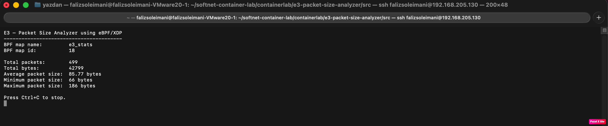
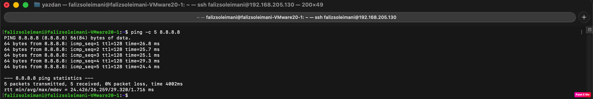
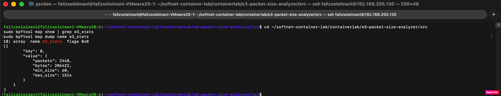

# E3 — Packet Size Analyzer using eBPF/XDP

## Goal

This project implements **E3 — Packet Size Analyzer** using **eBPF/XDP**.

The Basic level requirement is to track the **average packet size in real time**.

The program observes incoming packets, calculates their size, stores packet statistics in a BPF map, and shows the average packet size using a Python user-space monitor.

```text
average packet size = total bytes / total packets
```

---

## Basic Level Requirement

For the Basic level, the project tracks:

* total number of packets
* total number of bytes
* average packet size
* minimum packet size
* maximum packet size

The intermediate and advanced levels are not implemented because only the Basic level is required for this project.

---

## Project Location

This project is implemented inside the `softnet-container-lab` repository because E3 is an eBPF/XDP project.

Project folder:

```text
containerlab/e3-packet-size-analyzer/
```

Main project files:

```text
containerlab/e3-packet-size-analyzer/src/e3_packet_size.bpf.c
containerlab/e3-packet-size-analyzer/src/monitor_packet_size.py
containerlab/e3-packet-size-analyzer/src/Makefile
containerlab/e3-packet-size-analyzer/README_E3.md
containerlab/e3-packet-size-analyzer/screenshots/
```

---

## Project Architecture

```text
Incoming Network Packet
        ↓
XDP Hook
        ↓
eBPF Program
        ↓
BPF Map
        ↓
Python User-Space Monitor
        ↓
Real-Time Packet Size Statistics
```

The eBPF program runs at the XDP hook.

For every incoming packet, it calculates the packet size and updates a BPF map.

The Python monitor reads the BPF map every second and prints the packet statistics in a readable format.

---

## Implementation Details

The XDP program receives packet information through:

```c
struct xdp_md *ctx
```

The packet starts at:

```c
ctx->data
```

and ends at:

```c
ctx->data_end
```

The packet size is calculated as:

```c
packet_size = data_end - data;
```

For each packet, the eBPF program updates:

```text
packets
bytes
min_size
max_size
```

The Python monitor calculates:

```text
average = total bytes / total packets
```

The program returns:

```c
XDP_PASS
```

This means packets are not dropped or modified. The project only monitors traffic.

---

## Design Choices

### Why eBPF?

eBPF allows safe programs to run inside the Linux kernel without changing the kernel source code.

In this project, eBPF is used to inspect packets directly in the kernel.

### Why XDP?

XDP allows packet processing very early in the Linux networking stack.

This is useful for fast packet monitoring.

### Why a BPF Map?

A BPF map is used to share data between kernel space and user space.

The eBPF program updates the map, and the Python monitor reads the map.

### Why `XDP_PASS`?

The goal is monitoring, not filtering.

So the program always returns `XDP_PASS`, allowing packets to continue normally.

### Why Python?

The raw `bpftool` output is not easy to read.

The Python script reads the BPF map and prints clean real-time statistics.

---

## Files Added

### `src/e3_packet_size.bpf.c`

This file contains the eBPF/XDP program.

It calculates packet size and updates the BPF map.

### `src/monitor_packet_size.py`

This file contains the user-space monitor.

It reads the BPF map and prints the statistics.

### `src/Makefile`

This file builds the eBPF object file.

### `screenshots/`

This folder contains screenshots used as experimental evidence.

---

## Build Instructions

Go to the source folder:

```bash
cd ~/softnet-container-lab/containerlab/e3-packet-size-analyzer/src
```

Clean previous build files:

```bash
make clean
```

Build the eBPF program:

```bash
make
```

Expected output:

```text
e3_packet_size.bpf.o
```

Check that the object file exists:

```bash
ls -lh e3_packet_size.bpf.o
```

---

## Run Instructions

Find the active network interface:

```bash
ip -br link
```

In this VM, the active interface is:

```text
enp2s0
```

Attach the XDP program:

```bash
sudo ip link set dev enp2s0 xdp off 2>/dev/null
sudo ip link set dev enp2s0 xdp obj e3_packet_size.bpf.o sec xdp
```

Run the monitor:

```bash
sudo python3 monitor_packet_size.py
```

---

## Generate Traffic

Open a second terminal and run:

```bash
ping -c 5 8.8.8.8
```

This generates network traffic.

The monitor should update the packet count, total bytes, average packet size, minimum packet size, and maximum packet size.

---

## BPF Map Verification

The BPF map can be checked manually with:

```bash
sudo bpftool map show | grep e3_stats
sudo bpftool map dump name e3_stats
```

This shows the values stored in the kernel-side BPF map.

---

## Experimental Results

The project was tested by attaching the XDP program to the VM network interface and generating traffic with `ping`.

### Real-Time Monitor Output

The monitor shows live packet statistics.



### Traffic Generation

Traffic was generated using `ping`.



### BPF Map Output

The BPF map stores the packet statistics in kernel space.



---

## Clean Up

After testing, detach the XDP program:

```bash
sudo ip link set dev enp2s0 xdp off
```

Verify that XDP is detached:

```bash
sudo bpftool net
```

---

## Notes for Oral Presentation

This project implements the Basic level of E3 — Packet Size Analyzer.

The eBPF program is attached to the XDP hook.

For each incoming packet, it calculates the packet size using:

```c
packet_size = data_end - data;
```

It stores total packets, total bytes, minimum packet size, and maximum packet size inside a BPF map.

The Python monitor reads the map every second and calculates:

```text
average packet size = total bytes / total packets
```

The program returns `XDP_PASS`, so packets are not blocked or changed.

This demonstrates how eBPF/XDP can be used for real-time packet monitoring.
